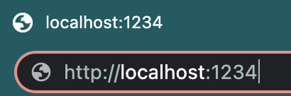
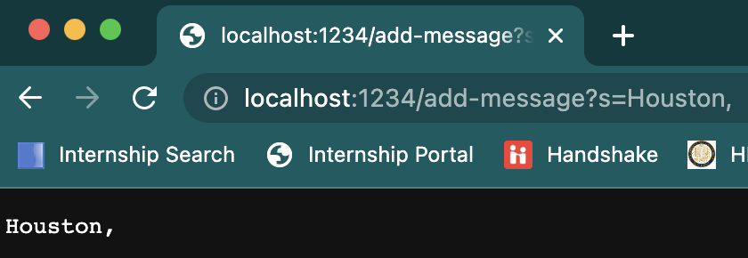
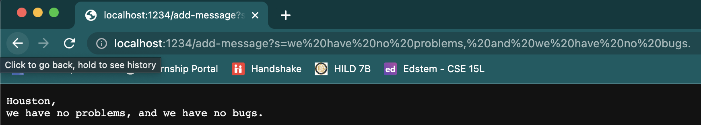
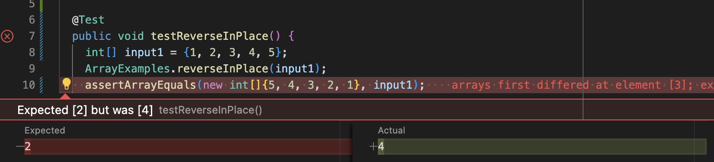

# Lab Report 2 - Servers and Bugs

**By Pranav Prabu**

> For this lab, every step is done through the MacOS

## Part 1 - Servers
This was my implementation for handling the request in StringServer.java:
```
public String handleRequest(URI url) {
  if (url.getPath().equals("/")) {
    return output;
  } else if (url.getPath().contains("/add-message")) { 
    String[] parameters = url.getQuery().split("=");
    if (parameters[0].equals("s")) {
      output += parameters[1] + "\n";
    }
    return output;
  } else {
    return "404 Not Found!";
  }
}
```

I set up my server using port 1234:



For the two tests, I used the following as my URL paths:

`/add-message?s=we%20have%20no%20problems,%20and%20we%20have%20no%20bugs.`

`/add-message?s=Houston,`

Here are the resulting screenshots:


*AddMessage Test 1*

The methods that are called to print this message are:

`public void handle(final HttpExchange exchange) throws IOException {`

`public String handleRequest(URI url) {`

For handle(final HttpExchange exchange), the argument required is HttpExchange exchange, and the field affecting the method is a URLHandler object named handler. The argument changes from this specific request as a unique URL and path are given to be accepted as the argument. Meanwhile, the field does not change.

For handleRequest(URI url), the argument required is the URI object containing the information need to be spliced, and the field is String output for the method to return. The argument changes due to this specific request as a unique URI is given for each request, and the field also changes for this specific request, as the field is directly correlated to the URI object, and so if the URI object changes, the field also changes.



*AddMessage Test 2*

The methods that are called to print this message are also:

`public void handle(final HttpExchange exchange) throws IOException {`

`public String handleRequest(URI url) {`

Similarly to the first request, for handle(final HttpExchange exchange), the argument required is HttpExchange exchange, and the field affecting the method is a URLHandler object named handler. The argument changes from this specific request as a unique URL and path are given to be accepted as the argument. Meanwhile, the field does not change.

Similarly to the first request, for handleRequest(URI url), the argument required is the URI object containing the information need to be spliced, and the field is String output for the method to return. The argument changes due to this specific request as a unique URI is given for each request, and the field also changes for this specific request, as the field is directly correlated to the URI object, and so if the URI object changes, the field also changes. 

## Part 2 - Bugs
A failure-inducing input for the buggy program in ArrayExamples is the input of 

```
@Test
public void testReverseInPlace() {
    int[] input = {1, 2, 3, 4, 5};
    ArrayExamples.reverseInPlace(input);
    assertArrayEquals(new int[]{5, 4, 3, 2, 1}, input);
}
```
for the method reverseInPlace.

A non-failure-inducing input for the buggy program in ArrayExamples is the input of

```
@Test
public void testReverseInPlace() {
    int[] input = {1, 2, 3, 2, 1};
    ArrayExamples.reverseInPlace(input);
    assertArrayEquals(new int[]{1, 2, 3, 2, 1}, input);
}
```
for the method reverseInPlace.

Symptoms of failure-inducing input:


Symptoms of non-failure-inducing input:


Before bugfix:
```
static void reverseInPlace(int[] arr) {
    for(int i = 0; i < arr.length; i += 1) {
      arr[i] = arr[arr.length - i - 1];
    }
}
```

After bugfix:
```
static int[] reverseInPlace(int[] arr) {
    for(int i = 0; i < arr.length/2; i += 1) {
      int temp = arr[i];
      arr[i] = arr[arr.length - i - 1];
      arr[arr.length - i - 1] = temp;
    }
    return arr;
}
```

This fix addresses the issue, as it changes the way how the array stores the reversed values, ensuring that the values are properly reversed in the array. The initial method did half of the solution, as it properly reversed the values for the first half of the list. However, once it got to the second half, it started to access the already reversed values to replace the initial values of the second half of the list, which then led to an incorrect result. The fixed method adds a second value substitution into the repeated sequence, while also cutting the for loop's size in half to make sure that the method does not reverse the reversed elements. Through the fixed method, the initial value at `i` is stored into a temporary variable, and then the elements reverse. After reversing the elements, the ending value is substituted with the temporary variable's value, ensuring that the elements are properly reversed. The boolean expression `i < arr.length/2` makes sure that the elements are not reversed twice, which would lead to the original list.

# Part 3 - Learnings
Something that I did not know before attending Labs 2 and 3 was how to to create a local server to access and manipulate.
