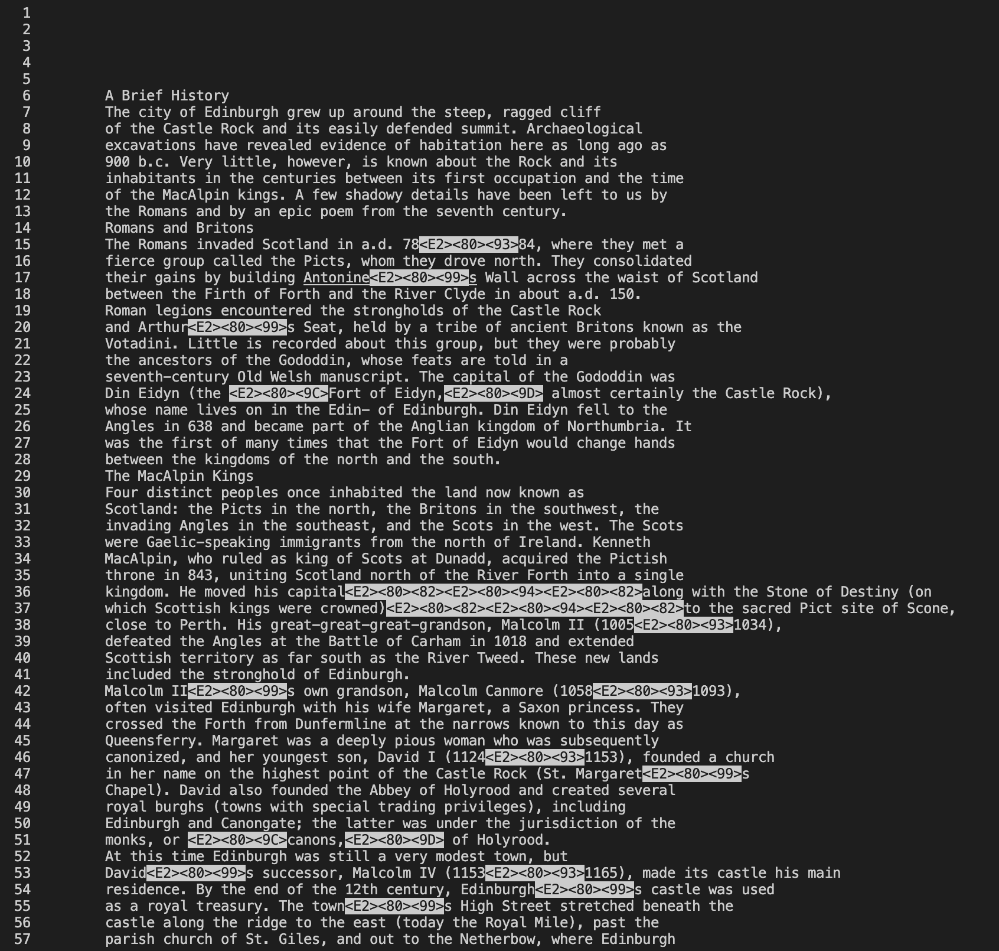
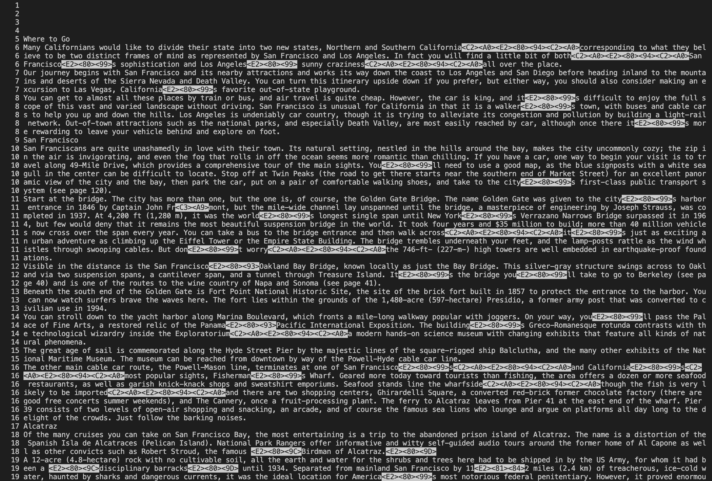
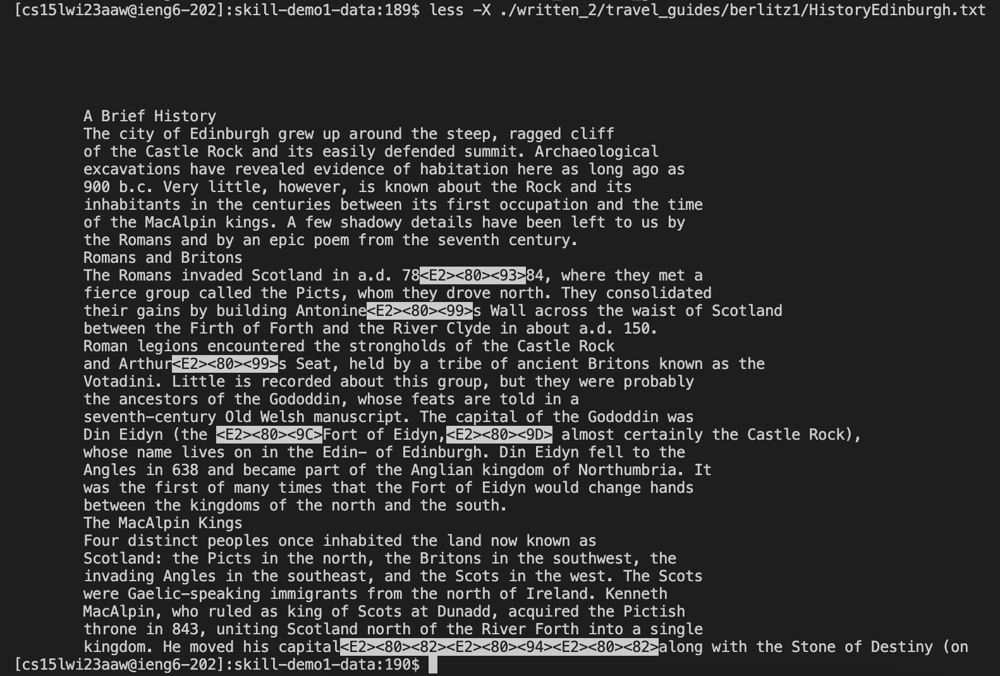
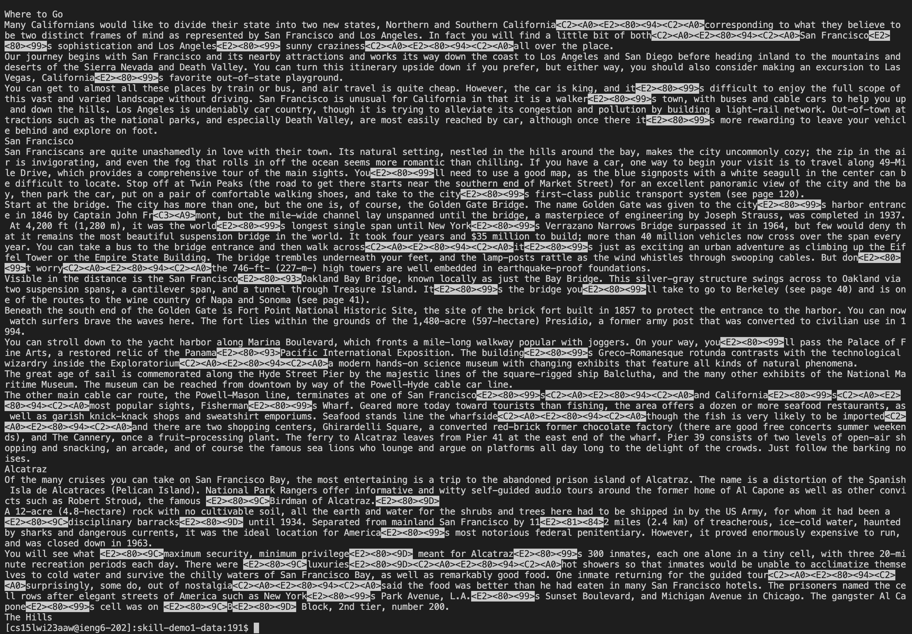
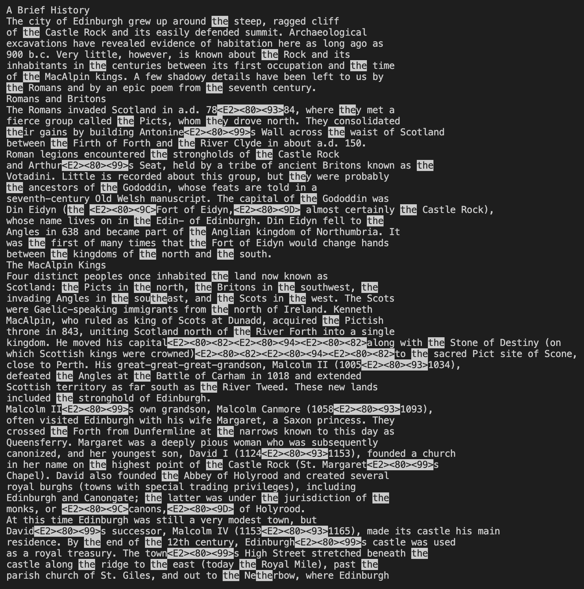
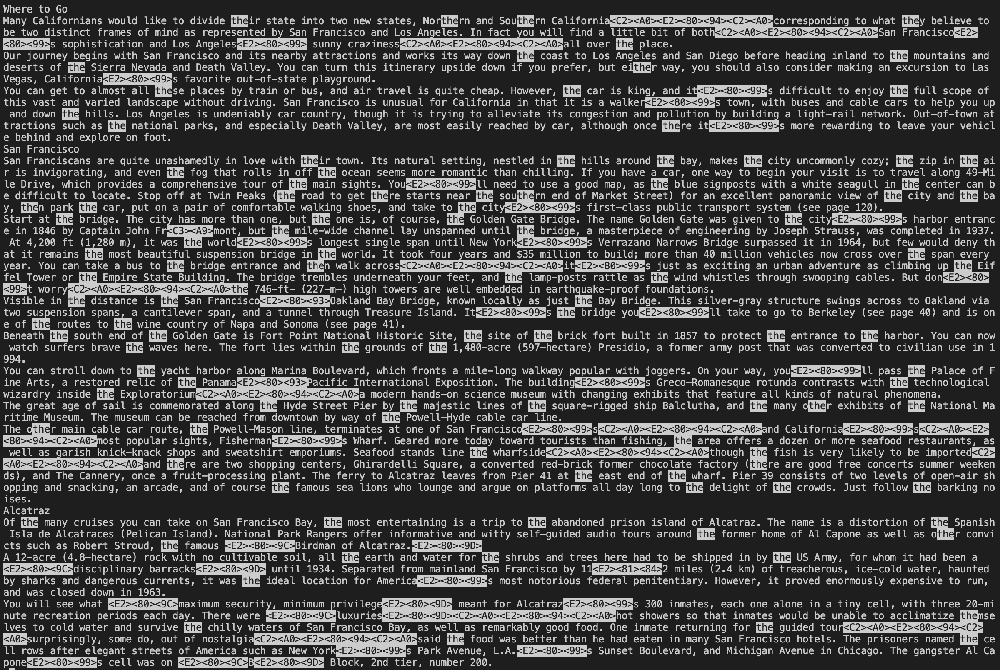
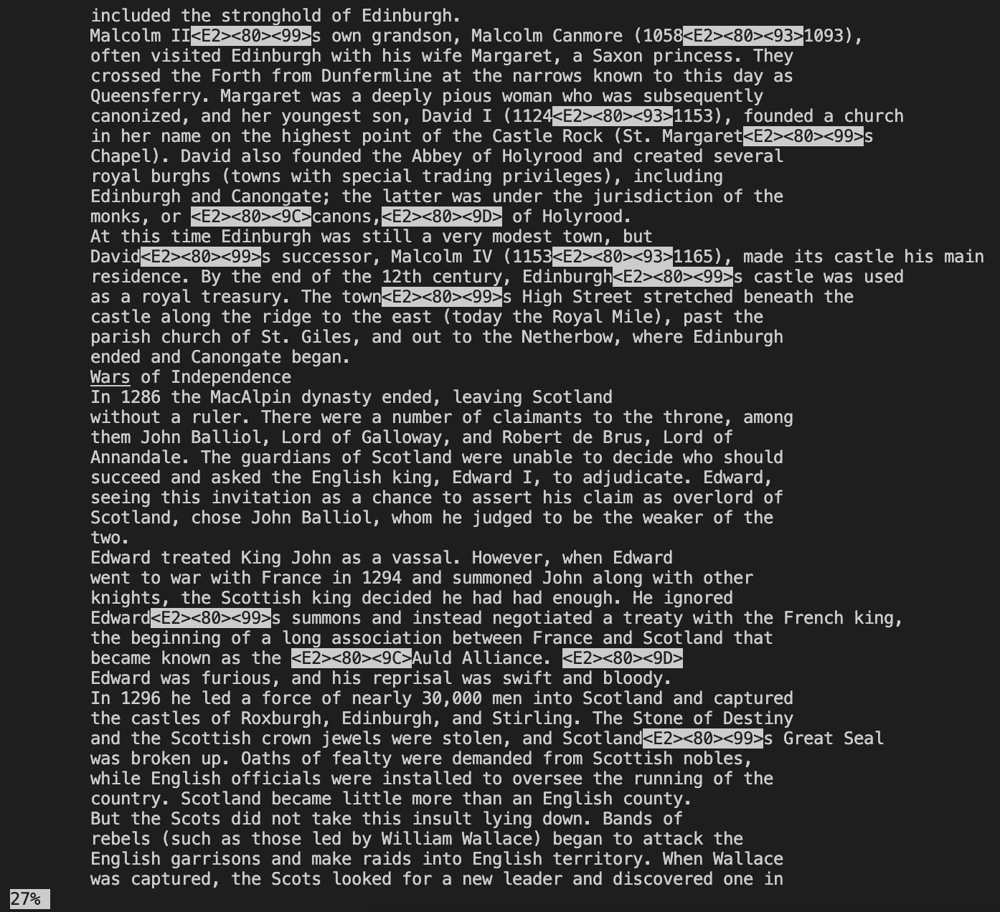

# Lab Report 3 - Researching Commands

**By Pranav Prabu**

> For this lab, I will be researching the functions of the `less` command.

## Option 1: -N

Format:
`$ less -N <file-path>`

This option in the `less` command shows line numbers at the side of the opened file. This option is useful, as it would be helpful for any user looking to cite a specific piece of evidence by using the line numbers on the right as a guide.

Example 1:
`$ less -N ./written_2/travel_guides/berlitz1/HistoryEdinburgh.txt`

Result:

> Line numbers show up on the left

Example 2:
`$ less -N ./written_2/travel_guides/berlitz2/California-WhereToGo.txt`

> Line numbers show up on the left

Result:

## Option 2: -X

Format:
`$ less -X <file-path>`

This option in the `less` command keeps the file open in the terminal even after finishing the command. This option is useful, as after using this option, you do not have to continually open up the file again using `less`, and simply have it in the terminal even after ending the command.

Example 1:
`$ less -X ./written_2/travel_guides/berlitz1/HistoryEdinburgh.txt`

Result:

> The file is left open in the terminal even after ending the command

Example 2:
`$ less -X ./written_2/travel_guides/berlitz2/California-WhereToGo.txt`

Result:

> The file is left open in the terminal even after ending the command

## Option 3: -p

Format:
`$ less -p<pattern> <file-path>`

This option in the `less` command highlights all matches within the file with the given pattern (is case-sensitive). This option is helpful, as if you are looking for a specfic piece of evidence within a text or file, using this option, you lessen the time spent searching for the specific piece of evidence needed.

Example 1:
`$ less -pthe ./written_2/travel_guides/berlitz1/HistoryEdinburgh.txt`

Result:

> The highlighted text matches with the pattern given in the command

Example 2:
`$ less -pthe ./written_2/travel_guides/berlitz2/California-WhereToGo.txt`

Result:

> The highlighted text matches with the pattern given in the command

## Option 4: -m

Format:
`$ less -m <file-path>`

This option in the `less` command shows the percentage of the file read so far within the terminal. This option is helpful, as when reading parts of the opened file through the `less` command, it is hard to see how far you are into the file. This option helps to streamline the process and inform the user how far they are in the file through a concise method.

Example 1:
`$ less -m ./written_2/travel_guides/berlitz1/HistoryEdinburgh.txt`

Result:

> The percentage of the file read is shown at the bottom left

Example 2:
`$ less -m ./written_2/travel_guides/berlitz2/California-WhereToGo.txt`

Result:

> The percentage of the file read is shown at the bottom left 

## Sources
To find all of these options for the less command, I used these two sources.

[https://linuxize.com/post/less-command-in-linux/](https://linuxize.com/post/less-command-in-linux/)

[https://phoenixnap.com/kb/less-command-in-linux#ftoc-heading-4](https://phoenixnap.com/kb/less-command-in-linux#ftoc-heading-4)
