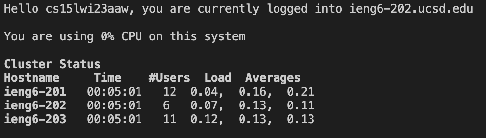
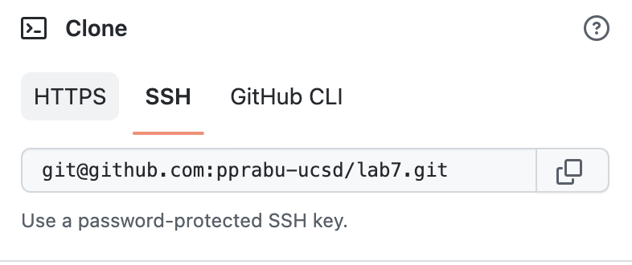
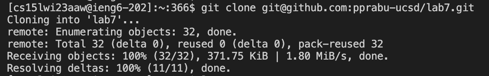
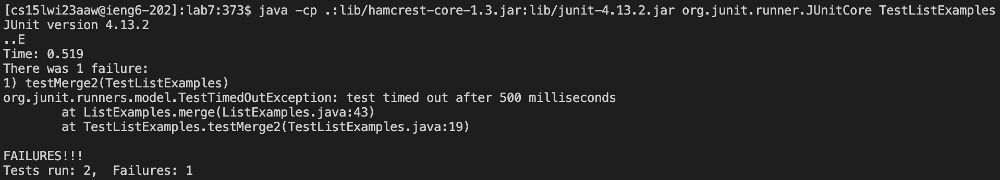
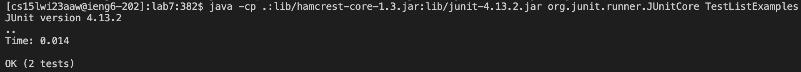
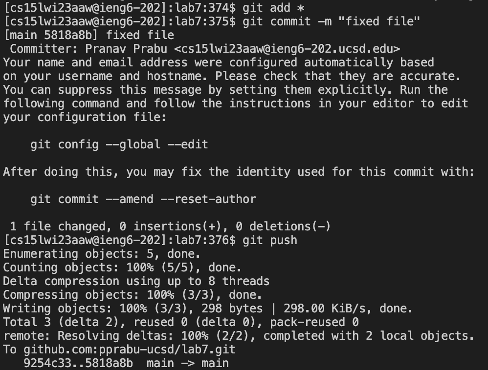

# Lab Report 4 - CSE Labs “Done Quick”

**By Pranav Prabu**

## Task #1: Log into ieng6
Keys pressed:
`<CTRL+R>` to start a search

Used `ssh` as the query

`<enter>` to finish the search and run the following command:

`ssh cs15lwi23aaw@ieng6.ucsd.edu`

`<CTRL+R>` allows me to search for previous commands made in the terminal using a query.

`ssh cs15lwi23aaw@ieng6.ucsd.edu` allows me to log into the remote server under my course specific account.

## Task #2: Clone your fork of the repository from your Github account
Copied the SSH key from GitHub:
`git@github.com:pprabu-ucsd/lab7.git`

After typing out `git clone`, I pasted the SSH key into the terminal to get:
`git clone git@github.com:pprabu-ucsd/lab7.git`

`<enter>` to clone the fork of the repository

`git clone` allows me to clone a repository from GitHub when offering a valid URL or SSH key to clone from.

## Task #3: Run the tests, demonstrating that they fail
`CTRL+R` to start a search

Used `javac` as the query

`<enter>` to finish the search and run the following command:

`javac -cp .:lib/hamcrest-core-1.3.jar:lib/junit-4.13.2.jar *.java`

`CTRL+R` to start a search

Used `TestL` as the query

`<enter>` to finish the search and run the following command:
`java -cp .:lib/hamcrest-core-1.3.jar:lib/junit-4.13.2.jar org.junit.runner.JUnitCore TestListExamples`

## Task #4: Edit the code file to fix the failing test
`CTRL+R` to start a search

Used `sed` as the query

`<enter>` to finish the search and run the following command:

`sed -i '43 s/1/2/1' ListExamples.java`

`sed` is a command that allows the user to edit the file without opening the file itself. In this particular case, `'43 s/1/2/1'` searches the 43rd line of the file, then searches for the first instance of the character `1` in the line, and changes the character to `2`.

## Task #5: Run the tests, demonstrating that they now succeed
`CTRL+R` to start a search

Used `javac` as the query

`<enter>` to finish the search and run the following command:

`javac -cp .:lib/hamcrest-core-1.3.jar:lib/junit-4.13.2.jar *.java`

`CTRL+R` to start a search

Used `TestL` as the query

`<enter>` to finish the search and run the following command:
`java -cp .:lib/hamcrest-core-1.3.jar:lib/junit-4.13.2.jar org.junit.runner.JUnitCore TestListExamples`

## Task #6: Commit and push the resulting change to your Github account

For this final step, I typed out the following commands:
`git add *`
`git commit -m "fixed file"`
`git push`

I found it easier and faster to just type them out rather than using arrow keys to find them.
