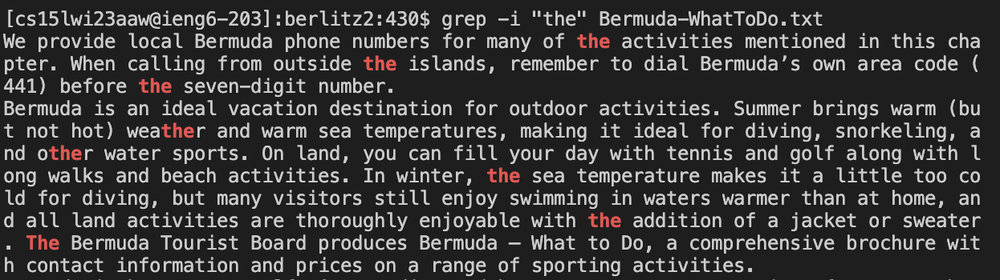
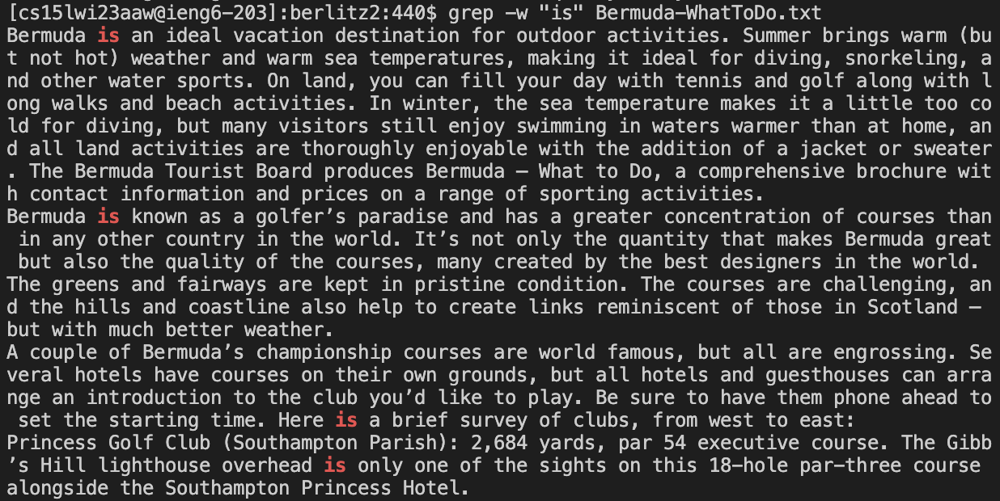

# Lab Report 5 - Putting It All Together

**By Pranav Prabu**

> For this lab, I will be revisiting Lab 3 - Researching Commands, looking into detail about the `grep` command this time compared to the `less` command last time.

## Process of Completing the Task
To complete the task, I initially started with researching the command itself. I then looked into the different flags that allowed the user to exapnd the command's purpose, finally testing it on a sample directory.

## Option 1: -i

**Format:**

`$ grep -i "<search-query>" <file>`

This option in the `grep` command allows the user to perform a case insensitive search for the given file using the given query. The result returns every line that contains an instance of the query in the given file.

> For this option, as it was not possible to highlight the parts of the code block that matched the pattern, the pattern will be fully capitalized in the text instead to convey the effect, and the actual images from the terminal will also be shown to show what it normally looks like.

**Example 1:**

`$ grep -i "the" Berlin-WhatToDo.txt`

**Result:**
```
[cs15lwi23aaw@ieng6-203]:berlitz2:429$ grep -i "the" Berlin-WhatToDo.txt
I n this liveliest of all German cities, THEre is no lack of activities once your sightseeing day is done. Whatever THE vagaries of world politics, Berlin has never relinquished its role as national capital in THE realm of THE arts or shopping.
Berliners are THE most assiduous concert- and THEater-goers in Europe, and you have to plan ahead if you want good tickets for THE main events. Ask your travel agency or THE Berlin tourist office for details of upcoming programs, and book in advance where possible. In addition to THE monthly publication Berlin Programm, produced by THE tourist office, THEre are two listings magazines, Tip and Zitty, published every two weeks, which give full details and reviews. Berlin, Das Magazin, a quarterly magazine published in German and English, mixes features, tourist information, and listings.
Symphonic music in Berlin is fueled by three of THE world’s greatest orchestras. THE Berliner Philharmoniker, housed in THE Philharmonie (see page 40), achieved glory under THE late Herbert von Karajan. THE highly rated Radio Symphony Orchestra Berlin and Berlin Symphony Orchestra also perform THEre, while Schinkel’s beautifully restored Schauspielhaus on Gendarmenmarkt (known as THE Konzerthaus Berlin) is anoTHEr important venue for classic music performances.
```


> Every line in the output contains a case-insensitive instance of the query

**Example 2:**

`$ grep -i "the" Bermuda-WhatToDo.txt`

**Result:**
```
[cs15lwi23aaw@ieng6-203]:berlitz2:430$ grep -i "the" Bermuda-WhatToDo.txt
We provide local Bermuda phone numbers for many of THE activities mentioned in this chapter. When calling from outside THE islands, remember to dial Bermuda’s own area code (441) before THE seven-digit number. 
Bermuda is an ideal vacation destination for outdoor activities. Summer brings warm (but not hot) weaTHEr and warm sea temperatures, making it ideal for diving, snorkeling, and oTHEr water sports. On land, you can fill your day with tennis and golf along with long walks and beach activities. In winter, THE sea temperature makes it a little too cold for diving, but many visitors still enjoy swimming in waters warmer than at home, and all land activities are thoroughly enjoyable with THE addition of a jacket or sweater. THE Bermuda Tourist Board produces Bermuda — What to Do, a comprehensive brochure with contact information and prices on a range of sporting activities.
```



> Every line in the output contains a case-insensitive instance of the query

## Option 2: -r

**Format:**

`$ grep -r "<search-query>" <directory>`

This option in the `grep` command allows the user to perform a search for the given string query through all files in the given directory. The result returns every file in the directory that contains an instance of the given string query and where the first instance is.

**Example 1:**

`$ grep -r "History" berlitz2`

**Result:**
```
[cs15lwi23aaw@ieng6-203]:travel_guides:433$ grep -r "History" berlitz2
berlitz2/Algarve-History.txt:A Brief History
berlitz2/Amsterdam-History.txt:a brief History
berlitz2/Athens-History.txt:A Brief History
berlitz2/Bahamas-History.txt:A Brief History
berlitz2/Bali-History.txt:A Brief History
berlitz2/Barcelona-History.txt:A Brief History
```

> Every line in the output is a file that contains a instance of the string query

**Example 2:**

`$ grep -r "History" berlitz1`

**Result:**
```
[cs15lwi23aaw@ieng6-203]:travel_guides:434$ grep -r "History" berlitz1
berlitz1/HistoryDublin.txt:        A Brief History
berlitz1/HistoryEdinburgh.txt:        A Brief History
berlitz1/HistoryEgypt.txt:        a brief History
berlitz1/HistoryFWI.txt:        A Brief History
berlitz1/HistoryGreek.txt:        a brief History
berlitz1/HistoryHawaii.txt:        A Brief History
berlitz1/HistoryHongKong.txt:        A Brief History
berlitz1/HistoryIbiza.txt:        •A Brief History
```

> Every line in the output is a file that contains a instance of the string query

## Option 3: -n

**Format:**

`$ grep -n "<search-query>" <file>`

This option in the `grep` command allows the user to perform a search for the given string query through the given file. The result returns the line and line number of for every line that contains an instance of the given string query.

**Example 1:**

`$ grep -n "Bermuda" Bermuda-WhatToDo.txt`

**Result:**
```
[cs15lwi23aaw@ieng6-203]:berlitz2:437$ grep -n "Bermuda" Bermuda-WhatToDo.txt
6:We provide local Bermuda phone numbers for many of the activities mentioned in this chapter. When calling from outside the islands, remember to dial Bermuda’s own area code (441) before the seven-digit number. 
8:Bermuda is an ideal vacation destination for outdoor activities. Summer brings warm (but not hot) weather and warm sea temperatures, making it ideal for diving, snorkeling, and other water sports. On land, you can fill your day with tennis and golf along with long walks and beach activities. In winter, the sea temperature makes it a little too cold for diving, but many visitors still enjoy swimming in waters warmer than at home, and all land activities are thoroughly enjoyable with the addition of a jacket or sweater. The Bermuda Tourist Board produces Bermuda — What to Do, a comprehensive brochure with contact information and prices on a range of sporting activities.
```

> Every line in the output shows the line and the line number that contains a instance of the string query

**Example 2:**

`$ grep -n "Berlin" Berlin-WhatToDo.txt`

**Result:**
```
[cs15lwi23aaw@ieng6-203]:berlitz2:438$ grep -n "Berlin" Berlin-WhatToDo.txt
6:I n this liveliest of all German cities, there is no lack of activities once your sightseeing day is done. Whatever the vagaries of world politics, Berlin has never relinquished its role as national capital in the realm of the arts or shopping.
8:Berliners are the most assiduous concert- and theater-goers in Europe, and you have to plan ahead if you want good tickets for the main events. Ask your travel agency or the Berlin tourist office for details of upcoming programs, and book in advance where possible. In addition to the monthly publication Berlin Programm, produced by the tourist office, there are two listings magazines, Tip and Zitty, published every two weeks, which give full details and reviews. Berlin, Das Magazin, a quarterly magazine published in German and English, mixes features, tourist information, and listings.
10:Symphonic music in Berlin is fueled by three of the world’s greatest orchestras. The Berliner Philharmoniker, housed in the Philharmonie (see page 40), achieved glory under the late Herbert von Karajan. The highly rated Radio Symphony Orchestra Berlin and Berlin Symphony Orchestra also perform there, while Schinkel’s beautifully restored Schauspielhaus on Gendarmenmarkt (known as the Konzerthaus Berlin) is another important venue for classic music performances.
```

> Every line in the output shows the line and the line number that contains a instance of the string query

## Option 4: -w

**Format:**

`$ grep -w "<search-query>" <file>`

This option in the `grep` command allows the user to perform a search for the given string query through the given file. The result returns every line that contains an whole-word instance of the given string query.

> For this option, as it was not possible to highlight the parts of the code block that matched the pattern, the pattern will be fully capitalized in the text instead to convey the effect, and the actual images from the terminal will also be shown to show what it normally looks like.

**Example 1:**

`$ grep -w "is" Berlin-WhatToDo.txt`

**Result:**
```
[cs15lwi23aaw@ieng6-203]:berlitz2:439$ grep -w "is" Berlin-WhatToDo.txt
I n this liveliest of all German cities, there IS no lack of activities once your sightseeing day IS done. Whatever the vagaries of world politics, Berlin has never relinquished its role as national capital in the realm of the arts or shopping.
Symphonic music in Berlin IS fueled by three of the world’s greatest orchestras. The Berliner Philharmoniker, housed in the Philharmonie (see page 40), achieved glory under the late Herbert von Karajan. The highly rated Radio Symphony Orchestra Berlin and Berlin Symphony Orchestra also perform there, while Schinkel’s beautifully restored Schauspielhaus on Gendarmenmarkt (known as the Konzerthaus Berlin) IS another important venue for classic music performances.
```


> Every line in the output contains a whole-word instance of the query

**Example 2:**

`$ grep -w "is" Bermuda-WhatToDo.txt`

**Result:**
```
[cs15lwi23aaw@ieng6-203]:berlitz2:440$ grep -w "is" Bermuda-WhatToDo.txt
Bermuda IS an ideal vacation destination for outdoor activities. Summer brings warm (but not hot) weather and warm sea temperatures, making it ideal for diving, snorkeling, and other water sports. On land, you can fill your day with tennis and golf along with long walks and beach activities. In winter, the sea temperature makes it a little too cold for diving, but many visitors still enjoy swimming in waters warmer than at home, and all land activities are thoroughly enjoyable with the addition of a jacket or sweater. The Bermuda Tourist Board produces Bermuda — What to Do, a comprehensive brochure with contact information and prices on a range of sporting activities.
Bermuda IS known as a golfer’s paradise and has a greater concentration of courses than in any other country in the world. It’s not only the quantity that makes Bermuda great but also the quality of the courses, many created by the best designers in the world. The greens and fairways are kept in pristine condition. The courses are challenging, and the hills and coastline also help to create links reminiscent of those in Scotland — but with much better weather. 
A couple of Bermuda’s championship courses are world famous, but all are engrossing. Several hotels have courses on their own grounds, but all hotels and guesthouses can arrange an introduction to the club you’d like to play. Be sure to have them phone ahead to set the starting time. Here IS a brief survey of clubs, from west to east:
Princess Golf Club (Southampton Parish): 2,684 yards, par 54 executive course. The Gibb’s Hill lighthouse overhead IS only one of the sights on this 18-hole par-three course alongside the Southampton Princess Hotel.
```



> Every line in the output contains a whole-word instance of the query

## Sources
To find all of these options for the `grep` command, I used this source:

[https://man7.org/linux/man-pages/man1/grep.1.html](https://man7.org/linux/man-pages/man1/grep.1.html)