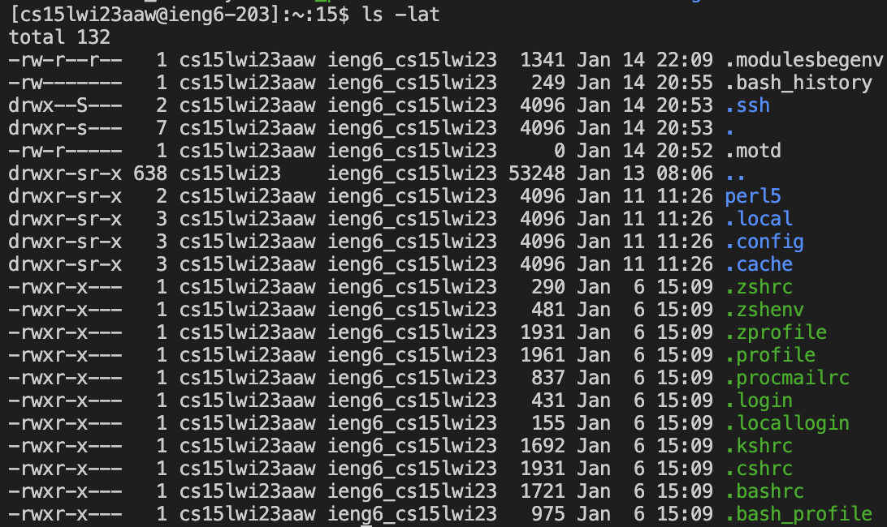

# Lab Report 1 - Remote Access and Filesystem

**By Pranav Prabu**

> For this tutorial, every step is done through MacOS.

## Installing Visual Studio Code

The first step necessary for connecting with remote access is installing the Visual Studio Code IDE. This gives you access to an easy-to-use terminal to interface with the remote server.

To install the Visual Studio Code IDE, go to the [VS Code website](https://code.visualstudio.com/) and download the installer that is compatible with your computer's operating system. After downloading the installer, run the installer. After running the installer and opening the application, your screen should look similar to this:

---

---
Then go to the top bar and click on Terminal, and then click on New Terminal.

---

---

## Connecting to the Remote Server
After installing VS Code, the next step is to connect to the remote server. First, you need to get your user account name and password from the [Account Lookup website](https://sdacs.ucsd.edu/~icc/index.php). You can get your ID and password by entering in your username from your school email address and your PID (Make sure to use a lowercase a when typing in your PID). After getting your account information go to your terminal in VS Code and enter

`ssh *your CSE 15L account ID goes here*`

The terminal will then ask for your password. Enter your password, and you should be connected to the remote sever. Overall, the process should look something similar to this:

---

---

## Running Terminal Commands
After accessing the remote server, you can test out commands through the remote server. Here are some sample commands and what they do:

`cd`
> Allows you to access files in the directory

`ls -a`
> Shows all files within the folder currently accessed by the terminal

`ls -lat`
> Shows all files within the folder currently accessed by the terminal along with additional information

`ls <directory>`
> Shows files within the directory specified by the user

`exit`
> Exits the remote server terminal

## Conclusion
Congrats! You have accessed your CSE 15L account for the first time, and used commands within the remote server! Good luck with your future work in CSE 15L!
